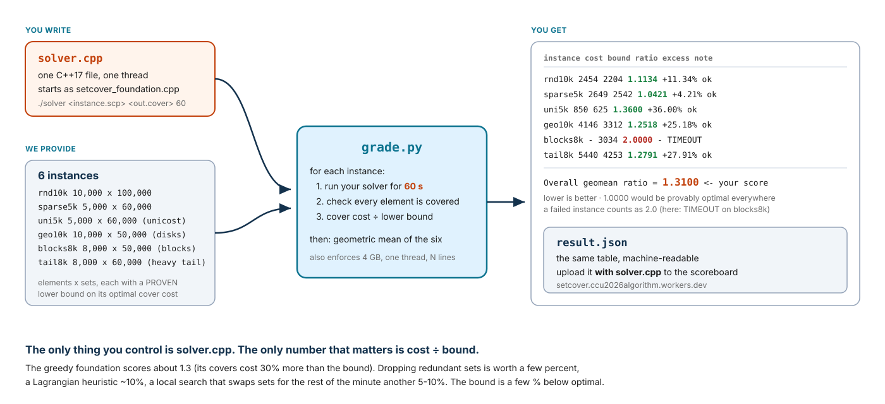

# Set Cover — Approximation Competition

You are given a working greedy approximation for weighted Set Cover,
`setcover_foundation.cpp` (GREEDY_SET_COVER, slide 13 of *Set Cover*, with
cost per newly covered element as the rule). Copy it to `solver.cpp` and make
its covers **cheaper**. Same input, a valid cover out, 60 seconds, one thread.

This is not a speed contest. Every solver gets the same 60 s per instance.
What is measured is **how close your cover is to the optimum**: the cost of
your cover divided by a proven lower bound on the optimal cost. 1.000 would
be optimal. The foundation scores about 1.28.

**Your entire job is one C++ file.** Everything else — running, timing,
checking, scoring — is done by one Python script, `grade.py`. You hand in
`solver.cpp` and the `result.json` it writes by uploading them to the
scoreboard at **https://setcover.ccu2026algorithm.workers.dev**
(see [What to submit](#what-to-submit)).

## How the pieces fit



You only touch `solver.cpp`. One command produces the table on the right, and
the `Overall geomean ratio` line is your score. **Lower is better.**

## Quick start

```sh
make foundation                          # 1. build the baseline
scripts/download.sh                      # 2. fetch the six scored instances (37 MB, once)
cp setcover_foundation.cpp solver.cpp    # 3. this file is your assignment
make solver                              #    ...edit solver.cpp, rebuild...
python3 grade.py --solver ./solver --instances instances_dev.txt              # 4. quick check (1 min)
python3 grade.py --solver ./solver --instances instances.txt --json result.json   # 5. score (6 min)
```

Step 5 prints a table and writes `result.json`. Before you change anything,
`solver.cpp` *is* the foundation, so this is what you see (times in seconds):

```
category   instance         m      n limit   wall     cost    bound   ratio  excess  note
----------------------------------------------------------------------------------------------------
RANDOM     rnd10k       10000 100000    60    0.1     2753     2204  1.2491  24.91%  ok
RANDOM     sparse5k      5000  60000    60    0.0     2978     2542  1.1715  17.15%  ok
RANDOM     uni5k         5000  60000    60    0.0      866      625  1.3856  38.56%  ok
STRUCTURED geo10k       10000  50000    60    0.2     4309     3312  1.3010  30.10%  ok
STRUCTURED blocks8k      8000  50000    60    0.1     3728     3034  1.2287  22.87%  ok
STRUCTURED tail8k        8000  60000    60    0.0     5707     4253  1.3419  34.19%  ok

Random     geomean ratio = 1.2657  (n=3)
Structured geomean ratio = 1.2897  (n=3)
Overall    geomean ratio = 1.2776  (n=6)   <- your score; lower is better, 1.0000 would be optimal
```

As you improve `solver.cpp` the `ratio` column falls towards 1. An
illustrative result for a solver that prunes redundant sets, runs a
Lagrangian heuristic and a local search, and runs out of time on one instance:

```
category   instance         m      n limit   wall     cost    bound   ratio  excess  note
----------------------------------------------------------------------------------------------------
RANDOM     rnd10k       10000 100000    60   59.9     2454     2204  1.1134  11.34%  ok
RANDOM     sparse5k      5000  60000    60   59.9     2649     2542  1.0421   4.21%  ok
RANDOM     uni5k         5000  60000    60   59.9      850      625  1.3600  36.00%  ok
STRUCTURED geo10k       10000  50000    60   59.9     4146     3312  1.2518  25.18%  ok
STRUCTURED blocks8k      8000  50000    60   61.0        -     3034  2.0000       -  TIMEOUT
STRUCTURED tail8k        8000  60000    60   59.9     5440     4253  1.2791  27.91%  ok

Overall    geomean ratio = 1.3100  (n=6)   <- your score; lower is better, 1.0000 would be optimal
```

`note=ok` means a valid cover was written in time. Anything else means that
instance scored **2.0**, and the `TIMEOUT` line above cost this solver most of
its score (without it the mean would be about 1.20). A valid cover
first, then a cheap one. Manage your clock: the limit is `argv[3]`, and the
grader kills you at 61 s whatever you were about to write.

That is the whole workflow. Repeat step 5 as you improve `solver.cpp`, and
upload the two files whenever you want to see where you stand.

### Iterating quickly

The scored run takes six minutes if your solver uses its whole budget. While
you work, use the dev set, which is already in the repo, has the same six
families at 500–1,000 elements, and gives each 10 s:

```sh
python3 grade.py --solver ./solver --instances instances_dev.txt
```

The dev set is for checking validity and rough quality. Only `instances.txt`
is scored.

## The rules

Your `solver.cpp` must:

1. Start from `setcover_foundation.cpp`. You may replace any part of it, but
   keep the command line: `./solver <instance.scp> <output.cover> <time_limit_s>`.
2. Write a **valid cover**: the indices of the chosen sets, one per line,
   each in `[0, n)` and listed at most once, whose union is every element.
3. Finish within the time limit given as `argv[3]` (60 s on the scored set).
   The grader kills the process one second after the limit; a run that is
   killed scores 2.0 even if a good cover was about to be written.
4. Be C++17 using only the standard library.
5. Be a single file: everything you write lives in `solver.cpp`, with no
   headers of your own. `#include` only standard library headers.
6. Be single-threaded.
7. Stay under 4 GB of memory.
8. Read nothing but the instance file. No cached covers, no precomputed
   answers in the source, no other files.

`grade.py` enforces rules 2, 3, 6 and 7 automatically. Rules 1, 4, 5 and 8
are checked by reading your `solver.cpp`. Randomised solvers are fine: the
grader runs you once, and what that run produces is your score.

## What to submit

Upload two files to the scoreboard:

**https://setcover.ccu2026algorithm.workers.dev**

- `solver.cpp`, the whole of your work in that one file
- `result.json`, written by step 5

Nothing else. `result.json` already records your costs, the bounds, the
score, and the SHA-256 of the `solver.cpp` it was measured from — so upload
the two files from the same run.

### How to upload

1. Open the scoreboard and click **Submit** (top right).
2. Enter your **Student ID** exactly as it appears in the course roster. It is
   shown publicly on the board.
3. Choose your `result.json` and your `solver.cpp`.
4. Click **Submit and view ranking**.

The server re-derives your score from the per-instance costs in `result.json`
and its own copy of the bounds, ranks on that, then redirects you to the board
with your row highlighted. Your `solver.cpp` is stored for the instructor
only; it is never shown to other students.

- **You may submit as many times as you like** before the deadline. Every
  attempt is kept; your **best (lowest)** score is the one that ranks (the
  *Tries* column counts attempts).
- The board closes at the deadline shown in the header. Late uploads are
  refused.
- **Overall / Random / Structured** switch the ranking key; Overall is the
  official one.
- Uploads that were not produced by `grade.py --json`, that come from the dev
  set, that used a different time limit, or that claim a cover cheaper than
  the proven bound are rejected with a message telling you what is wrong.

## How the score works

For each instance:

```
ratio = cover_cost / lower_bound
```

where `lower_bound` is a **proven** lower bound on the optimal cover cost of
that instance (see below). Your score is the geometric mean of the six
ratios. **Lower is better**; 1.0000 is the unreachable floor.

- **A failed instance scores 2.0 and still counts.** An invalid cover, a
  timeout, too much memory, or extra threads on one instance drags your mean
  up; they are never dropped. Running the unmodified foundation on an
  instance (1.17–1.39) is always better than failing it.
- Three instances are **RANDOM** (uniform random sets), three are
  **STRUCTURED** (geometric, block and heavy-tailed families). `grade.py`
  reports the two sub-means, but the overall geometric mean is your score.
- **The bound is not the optimum.** It is the value of the linear-programming
  relaxation, which on the weighted instances is a few percent below the true
  optimum and on the unicost one considerably more. A ratio of 1.08 means "at
  most 8% above optimal, probably less". Nobody will reach 1.000; the
  interesting range is roughly 1.02–1.30, so the board shows four decimals.
- **Machine speed matters a little.** A faster laptop gets more search done
  in the same 60 s. The effect is small next to the algorithmic differences,
  and the instructor re-runs the top submissions on one machine before final
  grades.

### What the notes mean

| note | meaning | ratio for that instance |
|---|---|---|
| `ok` | valid cover, within limits | `cover_cost / lower_bound` |
| `INVALID` | an element left uncovered, an index out of range or repeated, or junk (`invalid_reason` in result.json says which) | 2.0 |
| `TIMEOUT` | still running one second after the limit | 2.0 |
| `MEMORY` | exceeded 4 GB | 2.0 |
| `THREADS` | used more than one thread | 2.0 |
| `CRASH` / `NOOUTPUT` | non-zero exit, or no output file written | 2.0 |

## The data

Six instances are scored. Each is a different kind of set system, so a trick
that helps on one may not help on another:

| instance | elements | sets | family | what it is | bound | greedy | reference 60 s | reference 5 min |
|---|---:|---:|---|---|---:|---:|---:|---:|
| `rnd10k` | 10,000 | 100,000 | RANDOM | random sets of 5–25 elements, costs 1–100; the classic OR-Library shape, large | 2,204 | 1.2491 | 1.1134 | 1.1039 |
| `sparse5k` | 5,000 | 60,000 | RANDOM | random sets of 3–12 elements, costs 1–100; the bound is tight here, so the optimum is nearly within reach | 2,542 | 1.1715 | 1.0421 | 1.0417 |
| `uni5k` | 5,000 | 60,000 | RANDOM | random sets of 3–8 elements, every set costs 1; pure combinatorics, plateaus everywhere, a looser bound | 625 | 1.3856 | 1.3600 | 1.3568 |
| `geo10k` | 10,000 | 50,000 | STRUCTURED | points in the unit square covered by random disks; big disks are cheap per point but overlap | 3,312 | 1.3010 | 1.2518 | 1.2497 |
| `blocks8k` | 8,000 | 50,000 | STRUCTURED | elements on a line; a set is a contiguous block of 5–60 plus a few stray elements | 3,034 | 1.2287 | 1.1842 | 1.1809 |
| `tail8k` | 8,000 | 60,000 | STRUCTURED | heavy-tailed set sizes (3–100) with cost ~ size^0.9; the big sets look like bargains | 4,253 | 1.3419 | 1.2791 | 1.2730 |

*greedy* is the unmodified foundation; *reference* is the instructor's own
solver (greedy, redundancy removal, a Lagrangian heuristic, then a local
search that repeatedly drops a few sets and repairs the cover) given 60 s and
five minutes. Beating the five-minute reference is entirely possible with a
good local search and earns a badge on the board.

Each instance is two files in `instances/`: `<name>.scp` (the sets) and
`<name>.meta.json` (the bound, the reference costs, the file's SHA-256, and
how the sets were made). Every element is in at least two sets. Costs are
integers. The six `.scp` files total 37 MB and are fetched by
`scripts/download.sh` from the GitHub Release; the meta files and the
`dev_*` instances are in the repo.

**The final grading uses fresh instances** generated by the same code with
the same parameters and a different random seed, with bounds computed the
same way. Anything that depends on the exact bytes of the released files will
not carry over; anything that depends on the structure of the set systems
will.

## File formats

```
<instance.scp>                     <output.cover>
m n                                j_1
c_0 k_0 e_1 e_2 ... e_k0           j_2
c_1 k_1 e_1 ... e_k1               ...
...                                (indices of the chosen sets, one per line,
c_{n-1} k_{n-1} e_1 ... e_k         each 0 <= j < n and listed at most once)
```

Elements are `0..m-1`; set *j* has cost `c_j` and the `k_j` elements listed on
its line (sorted, no repeats). A cover is valid when the chosen sets together
contain every element; its cost is the sum of their costs. `grade.py` checks
both exactly in 64-bit integers.

## Where the bound comes from

`tools/bound/bound.cpp` computes a Lagrangian lower bound. For any
multipliers `u_i ≥ 0`, one per element,

```
L(u) = Σ_i u_i + Σ_j min(0, c_j − Σ_{i ∈ S_j} u_i)
```

is at most the cost of every cover (each element is covered at least once, so
every cover pays at least `Σ u_i` after discounting each chosen set by the
multipliers of its elements). A subgradient ascent pushes `L(u)` up to the
LP relaxation value; whatever it found is then re-evaluated exactly and
rounded up (costs are integers). You do not need it to compete — but the same
idea, run for a few seconds inside your solver, gives you *reduced costs*,
and a greedy on reduced costs is the classic Lagrangian heuristic.

## Everything else (optional reading)

**Sanity-check your environment** before you start:

```sh
make foundation && ./foundation samples/tiny.scp /tmp/tiny.cover 5 && cat /tmp/tiny.cover
```

It should print three set indices and `cover cost 8 (3 sets)` on stderr. (The
optimum for the sample is 7: sets 0 and 2. Greedy is greedy.)

**Practice instances.** `tools/gen/` is the real generator. To make fresh
instances with your own seed and bound them:

```sh
make tools                                          # builds tools/bound/bound
python3 -m tools.gen --manifest tools/manifest/public.json \
        --instance rnd10k --seed 12345 --salt mine --out mydata
tools/bound/bound mydata/rnd10k.scp --json          # prints {"lower_bound": ...}
```

Put the `lower_bound` into `mydata/rnd10k.meta.json`, list the instance in
your own instances file in the same `<category> <file.scp> <seconds>` format,
and point `--instances` at it.

**`tools/` is instructor tooling.** It is not part of your submission and is
not subject to the rules above.

**Keeping your covers.** `python3 grade.py ... --keep-covers covers/` saves
every cover the grader accepted.

| make target | what it does |
|---|---|
| `make foundation` | build the baseline |
| `make solver` | build your `solver.cpp` |
| `make tools` | build the lower-bound tool |
| `make test` | run `grade.py`'s own regression tests |
| `make check-data` | verify every instance against its meta file (slow) |
